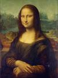
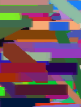
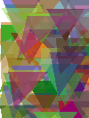
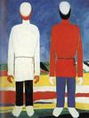
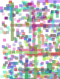
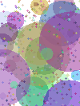

# Artifis

Artifis is a Python application that reconstructs images using a collection of basic geometric shapes (circles, rectangles, triangles, lines). It employs optimization algorithms like Simulated Annealing (SA), Particle Swarm Optimization (PSO), and Hill Climbing (HC) to find the optimal parameters for these shapes to best match a target image.

The application provides both a Graphical User Interface (GUI) for interactive use and a Command-Line Interface (CLI) for batch processing and scripting.

## Features

*   **Multiple Shape Types:** Approximate images using circles, rectangles, triangles, and lines.
*   **Various Optimization Algorithms:**
    *   Simulated Annealing (SA)
    *   Particle Swarm Optimization (PSO)
    *   Hill Climbing (HC)
*   **Flexible Color Schemes:** Supports RGB, grayscale, and a "both" mode (optimizes in RGB, also saves grayscale).
*   **Customizable Metrics:** Evaluate approximation quality using MSE, PSNR, SSIM or a weighted combination.
*   **Parameter Control:**
    *   Initialize shape parameters (size, color, alpha, coordinates) in various ways.
    *   Fix specific shape parameters during optimization.
*   **Load & Save Functionality:**
    *   Save detailed approximation results and shape data.
    *   Load previously saved shapes to continue optimization or use as a base.
*   **GUI & CLI:** Interactive graphical interface and powerful command-line options.
*   **GIF Generation:** Create animated GIFs of the approximation process.
*   **Extensible:** Designed with configuration files for shapes and borders, allowing for potential future additions.

## Examples of Output

| Original Image | 150 Lines | 100 Triangles |
| :------------: | :-------: | :-----------: |
|  |  |  |

| Original Image | 500 Rectangles | 500 Circles |
| :------------: | :-------: | :-----------: |
|  |  |  |

*The parameters used for the examples above are illustrative and can be varied extensively.*

## License

This project is licensed under the **GNU General Public License v3.0 (GPLv3)**.

A copy of the license can be found in the `LICENSE` file in the root of this repository.
For the full license text and more details, see <https://www.gnu.org/licenses/>.

## Installation

**Prerequisites:**
*   Python (version >= 3.10),
*   `pip`,
*   Git.

**Steps:**

1.  **Clone the Repository:**
    Open your terminal or command prompt and run:
    ```bash
    git clone https://github.com/eobawne/artifis.git
    cd artifis
    ```

2.  **Create and Activate a Virtual Environment (Highly Recommended):**
    This isolates the project's dependencies.

    *   **On macOS/Linux:**
        ```bash
        python3 -m venv .venv
        source .venv/bin/activate
        ```
    *   **On Windows:**
        ```bash
        python -m venv .venv
        .\.venv\Scripts\activate
        ```

3.  **Install Dependencies:**
    Navigate to the project's root directory (where `requirements.txt` is located) and run:
    ```bash
    pip install -r requirements.txt
    ```
    
    *Note on Numba:* The first time you run an optimization, Numba will compile some functions. This might make the very first run slightly slower. Subsequent runs will be faster (if you use GUI).

## Usage

Make sure your virtual environment with dependencies is activated.

### Graphical User Interface (GUI)

Navigate to the project's root directory in your terminal and run:
```bash
python __main__.py
```
This will launch the main application window.

**GUI Overview:**
*   **Input Settings:** Select input image, output directory, shape type, color scheme, border, and parameter/coordinate initialization modes.
*   **Load Shapes:** Load shapes from a previously saved `.json` results file (shapes data itself is in `.npy` file).
*   **Parameter Fixing:** Choose which shape parameters (coordinates and others like radius, color and etc.) remain fixed during optimization.
*   **Optimization Settings:** Choose the optimization method (SA, PSO, HC), evaluation metrics and their weights used in target function, number of shapes, GIF generation options, method-specific parameters (temperature for SA, swarm size for PSO and etc.).
*   **Output Settings:** Options for saving results and shape data. Buttons to view metric history plots will become active after a run.
*   **Controls:** Start/Stop the approximation process.
*   **Image Preview:** Shows the input image and output of the approximation.
*   **Log Output:** Displays progress messages, errors, and final metric scores.

### Command-Line Interface (CLI)

The CLI offers more direct control for batch processing or scripting.
Run from the project's root directory:
```bash
python __main__.py --help
```
This will display all available CLI arguments and their descriptions.

**Basic CLI Example:**
```bash
python __main__.py -i path/to/your/input.png -o path/to/your/output_directory \
                   -s circle -n 100 -c rgb -m sa --iterations 20000 \
                   -e ssim mse -w 0.8 0.2 --gif single --save-results --save-shapes
```
This example:
*   Uses `input.png` and saves to `output_directory`.
*   Approximates with 100 circles.
*   Uses RGB color scheme.
*   Uses Simulated Annealing for 20000 iterations.
*   Evaluates with SSIM (80% weight) and MSE (20% weight).
*   Generates a single-loop GIF.
*   Saves detailed results and shape data.

**Key CLI Arguments:**
*   `-i, --input`: Path to the input image.
*   `-o, --output`: Path to the output directory.
*   `-s, --shape`: Shape type (`circle`, `rectangle`).
*   `-n, --num_shapes`: Number of shapes.
*   `-c, --color`: Color scheme for output(`rgb`, `grayscale`, `both`).
*   `-m, --method`: Optimization method (`sa`, `pso`, `hc`).
*   `--iterations`: Number of iterations for the chosen method.
*   `-e, --metric`: Evaluation metric(s) (`ssim`, `psnr`, `mse`).
*   `-w, --weights`: Weights for the metrics.
*   `--load-shapes PATH_TO_JSON`: Load initial shapes from a results JSON file.
*   ... for more see `python __main__.py --help`.

## Configuration Files

The application uses JSON configuration files located in the `configs/` directory:
*   `configs/shapes/`: Defines parameters for each shape type (`circle.json` defines `radius`).
*   `configs/borders/`: Defines parameters for border types (not fully implemented yet, blank).

You can change these files to specify shape parameter bounds (min/max) and border-specific values (like padding).

## Future Work (Potential)
*   Full Sphinx-based documentation.
*   `setup.py` for system-wide (within venv) installation and entry points.
*   Additional optimization algorithms and their options.
*   More shape types (including custom image).